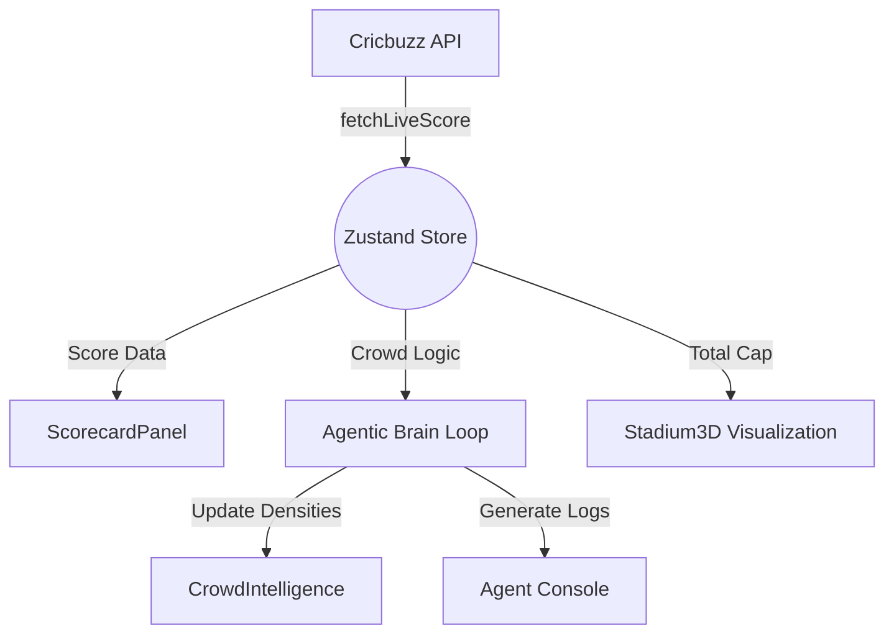

# Agentic Premier League (APL) - Architecture & Logic Overview

This document provides a technical walkthrough of the core logic driving the APL Stadium Management Dashboard.

---

## 1. Core Tech Stack
- **Framework**: React 18 + TypeScript.
- **State Management**: **Zustand** (Centralized store for real-time reactivity).
- **Styling**: Tailwind CSS (Midnight Cyber theme with glassmorphism).
- **Animations**: **Framer Motion** (Used for micro-interactions, layout transitions, and numerical count-ups).
- **3D Visualization**: **Three.js** (@react-three/fiber) for the spatial stadium model.
- **Charts**: **Recharts** for match analytics.

---

## 2. Centralized State (`src/store/index.ts`)
The `useStore` hook is the "Brain" of the application. It handles three distinct logical streams:

### A. Match Intelligence (Real API Sync)
- **Function**: `fetchLiveScore()`
- **Logic**: 
  - Performs an asynchronous `fetch` call to the **Cricbuzz RapidAPI**.
  - Maps deep-nested JSON data (innings, batsmen, bowlers, fow, partnerships) into a clean `LiveMatchData` interface.
  - Handles numerical parsing for string-based API values (Strike Rates, Economy).

### B. Crowd Intelligence (Spatial Logic)
- **State**: `sectors[]`
- **Logic**: 
  - The stadium is divided into 4 main sectors (Gate A-D).
  - Each sector has a `density` value (0-100%).
  - Logic in `CrowdIntelligence.tsx` determines background colors based on density (Green: <40%, Yellow: <75%, Red: >75%).

### C. The Agentic Brain (Simulation)
- **Function**: `startSimulation()`
- **Heartbeat**: 5-second interval.
- **Logic Flow**:
  1. **Poll API**: Triggers `fetchLiveScore()` and awaits the result.
  2. **Event Detection**: Compares the new score/wickets against `lastKnownScore` and `lastKnownWickets`.
  3. **Trigger AI Logs**: 
     - **Wicket Detected**: Triggers a `REAL-TIME ALERT`, increases stadium surveillance, and spikes density in specific zones.
     - **Boundary Detected**: Triggers a `CROWD ROAR` event, identifying peak audio volume.
  4. **Dynamic Scaling**: Adjusts `avgWaitTime` and `surgeProtocolActive` based on the intensity factor of the match events.

---

## 3. UI Logic Highlights

### Animated Scoreboard (`ScorecardPanel.tsx`)
- **CountUp Hook**: Instead of static numbers, we use a custom `CountUp` component with Framer Motion's `animate()` function. This creates a smooth roll-up effect whenever the API score increases.
- **Century Highlight**: Automatically detects players with 50+ runs and applies a special neon glow card and "Impact Player" badge.

### Zone Density Heatmap (`CrowdIntelligence.tsx`)
- Uses a grid layout to represent the stadium sectors.
- Features individual progress bars for each sector that update in real-time as the simulation shifts people around the venue.

### Spatial Topology (`Stadium3D.tsx`)
- Renders a 3D stadium using `react-three-fiber`.
- The "particle" cloud intensity in the 3D model is linked to the overall `totalCrowd` and `avgWaitTime` state from the store.

### Side-Nav Logic
- **Agent Console**: Focused on the AI brain and autonomous logs.
- **Smart Navigation**: AI-driven pathfinding for fans.
- **Food/Facilities**: Real-time tracker for wait times and washroom availability.

---

## 4. Key Data Flow Diagram

---

## 5. Maintenance Tips
- **To change Match ID**: Update the URL in `src/store/index.ts` (currently set to Match 151889).
- **To adjust Simulation Speed**: Modify the `window.setInterval` duration in `startSimulation`.
- **To edit Design System**: All colors and glassmorphism tokens are defined in `src/index.css`.
